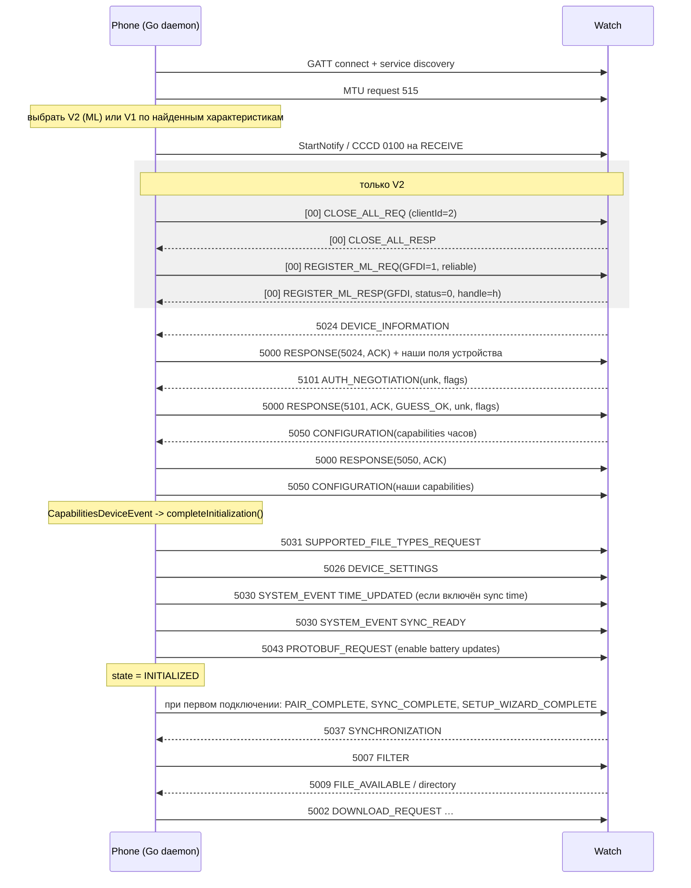

# Garmin BLE-транспорт и GFDI: полная спецификация для порта на Go

Источник: `/Users/qq/garpun-ut/pulse-main`. Все пути ниже — относительно
`app/src/main/java/nodomain/freeyourgadget/gadgetbridge/` (в тексте сокращено до `…/`);
тесты — относительно `app/src/test/java/nodomain/freeyourgadget/gadgetbridge/`.

Стек снизу вверх:

```
BLE GATT (BlueZ) -> ICommunicator (V1 | V2/ML [+ MLR]) -> COBS -> GFDI-кадр (len+type+payload+CRC) -> GFDIMessage
```

---

## 1. Таблица UUID

| Назначение | UUID | Файл:строка |
|---|---|---|
| **V0** service GFDI (Vivofit / Forerunner 620) | `9B012401-BC30-CE9A-E111-0F67E491ABDE` | `…/service/devices/garmin/communicator/v1/CommunicatorV1.java:23` |
| V0 characteristic SEND (phone→watch, write) | `DF334C80-E6A7-D082-274D-78FC66F85E16` | `CommunicatorV1.java:24` |
| V0 characteristic RECEIVE (watch→phone, notify) | `4ACBCD28-7425-868E-F447-915C8F00D0CB` | `CommunicatorV1.java:25` |
| **V1** service GFDI (Vivomove HR и большинство старых) | `6A4E2401-667B-11E3-949A-0800200C9A66` | `CommunicatorV1.java:28` |
| V1 characteristic SEND | `6A4E4C80-667B-11E3-949A-0800200C9A66` | `CommunicatorV1.java:29` |
| V1 characteristic RECEIVE | `6A4ECD28-667B-11E3-949A-0800200C9A66` | `CommunicatorV1.java:30` |
| **V2** service ML-GFDI | `6A4E2800-667B-11E3-949A-0800200C9A66` | `…/communicator/v2/CommunicatorV2.java:52-53` |
| V2 characteristic RECEIVE (notify), кандидаты | `6A4E2810…`, `6A4E2811…`, `6A4E2812…`, `6A4E2813…`, `6A4E2814…` (суффикс `-667B-11E3-949A-0800200C9A66`) | `CommunicatorV2.java:92-95` |
| V2 characteristic SEND (write), парный | receive + `0x10`: `6A4E2820…` … `6A4E2824…` | `CommunicatorV2.java:92-95` |
| CCCD дескриптор | `00002902-0000-1000-8000-00805f9b34fb` | `…/service/btle/GattDescriptor.java:27` |
| Battery Service (только HRM-устройства) | стандартный `0000180F-…`, char `00002A19-…` | `…/service/devices/garmin/GarminSupportHrm.java:57-60` |
| Heart Rate Service (только HRM) | стандартный `0000180D-…`, char `00002A37-…` | `GarminSupportHrm.java:62-66, 79-81` |

Базовый шаблон V2: `BASE_UUID = "6A4E%04X-667B-11E3-949A-0800200C9A66"` (`CommunicatorV2.java:52`).
Заметьте: V1-UUID укладываются в тот же шаблон (`2401` / `4C80` / `CD28`); V0 — отдельное семейство.

Регистрация поддерживаемых сервисов: `GarminSupport.java:198-200`
(`addSupportedService(UUID_SERVICE_GARMIN_GFDI_V0 / _V1 / _ML_GFDI)`).

---

## 2. Определение версии протокола (V1 vs V2)

`GarminSupport.initializeDevice()` (`…/service/devices/garmin/GarminSupport.java:307-331`):

1. `builder.setDeviceState(INITIALIZING)`.
2. Если pref `PREF_ALLOW_HIGH_MTU` (по умолчанию true) → `builder.requestMtu(515)` (`:310-312`).
3. **Сначала V2**: `new CommunicatorV2(this).initializeDevice(builder)` — перебор `i = 0x2810…0x2814`,
   receive = `6A4E{i}…`, send = `6A4E{i+0x10}…`; если найдены оба — это V2 (`CommunicatorV2.java:90-105`).
4. Иначе **V1**: сначала пара V1 (`6A4E4C80` / `6A4ECD28`), при отсутствии — пара V0
   (`DF334C80` / `4ACBCD28`) (`CommunicatorV1.java:49-62`).
5. Ничего не найдено → `setDeviceState(NOT_CONNECTED)`, «не Garmin» (`GarminSupport.java:321-325`).

То есть детект — **по наличию характеристик в GATT-дереве после service discovery**, не по advertising.
Приоритет всегда у V2 (ML). Координатор устройств (`…/devices/garmin/GarminCoordinator.java:187-189`)
сам UUID не проверяет — только выбирает класс `GarminSupport`.

---

## 3. Механика V1 (и V0)

Файл `…/communicator/v1/CommunicatorV1.java`.

* Две характеристики: SEND (write), RECEIVE (notify). Отдельной flow-control характеристики **нет**.
* Инициализация: единственное действие — `builder.notify(characteristicReceive, true)` (`:64`).
  Внутри: `gatt.setCharacteristicNotification(char, true)` + запись в CCCD `2902` значения
  `ENABLE_NOTIFICATION_VALUE = 01 00` (`…/service/btle/actions/NotifyAction.java:106-118`).
  В BlueZ эквивалент — `StartNotify()` (CCCD пишет сам стек).
* Отправка (`CommunicatorV1.java:88-108`):
  * `payload = CobsCoDec.encode(gfdiFrame)`;
  * нарезка на куски **не длиннее `maxWriteSize - 1`** байт;
  * каждый кусок — отдельный GATT write в SEND-характеристику, **без какого-либо заголовка**;
  * строгий последовательный порядок записей (очередь транзакций).
* Приём (`CommunicatorV1.java:110-120`): значение нотификации целиком → `cobsCoDec.receivedBytes(value)`,
  затем `retrieveMessage()`; не-null → `GarminSupport.onMessage()`.
* Realtime-сервисы (HR / steps / accel / SpO2 / HRV) в V1 **не поддерживаются** (`:122-150`).

`maxWriteSize` по умолчанию 20, обновляется из MTU:
`calcMaxWriteChunk(mtu) = min(512, max(23, mtu) - 3)` (`…/service/btle/AbstractBTLEDeviceSupport.java:92-99`).
При MTU 515 → 512, полезная нагрузка одной записи в V1 = 511 байт.

---

## 4. Механика V2 (ML, Multi-Link) и MLR

Файл `…/communicator/v2/CommunicatorV2.java`.

### 4.1 Идея

Одна пара характеристик мультиплексирует несколько логических «сервисов» через **1-байтовый handle**
в начале каждого GATT-пакета. Handle `0x00` — канал управления (register/close). GFDI ходит по handle,
выданному при регистрации сервиса `GFDI(1)`.

### 4.2 Инициализация (`CommunicatorV2.java:90-105`)

1. Найти пару характеристик (§2).
2. `notify(characteristicReceive, true)` → CCCD `01 00`.
3. Сразу же `write(characteristicSend, closeAllServices())` и выставить флаг `closingAll = true`.

### 4.3 Управляющие пакеты (handle 0), всё little-endian

Все три — ровно 13 байт (`CommunicatorV2.java:646-672`):

```
CLOSE_ALL_REQ:     00 | 05 | clientId (int64 = 2) | 00 00
REGISTER_ML_REQ:   00 | 00 | clientId (int64 = 2) | serviceCode (uint16) | reliable (0 | 2)
CLOSE_HANDLE_REQ:  00 | 02 | clientId (int64 = 2) | serviceCode (uint16) | handle (uint8)
```

`GADGETBRIDGE_CLIENT_ID = 2` (`CommunicatorV2.java:55`). `reliable = 2` включает MLR, `0` — обычный ML.

`RequestType` (ordinal-enum, `CommunicatorV2.java:604-624`):

| код | имя |
|---|---|
| 0 | REGISTER_ML_REQ |
| 1 | REGISTER_ML_RESP |
| 2 | CLOSE_HANDLE_REQ |
| 3 | CLOSE_HANDLE_RESP |
| 4 | UNK_HANDLE |
| 5 | CLOSE_ALL_REQ |
| 6 | CLOSE_ALL_RESP |
| 7 | UNK_REQ |
| 8 | UNK_RESP |

Разбор входящего на handle 0 (`:296-310`): `uint8 handle(=0) | uint8 type | int64 clientId | …`;
если `clientId != 2` — пакет игнорируется.

* `REGISTER_ML_RESP` (`:319-330`): `uint16 serviceCode | uint8 status | uint8 handle | uint8 reliable`.
  `status != 0` → регистрация не удалась. `reliable != 0` → поверх handle поднимается `MlrCommunicator` (`:369-384`).
* `CLOSE_HANDLE_RESP` (`:389-394`): `uint16 serviceCode | uint8 handle | uint8 status`.
  Если закрылся GFDI и мы не в процедуре close-all → немедленный повторный `REGISTER_ML_REQ(GFDI)` (`:411-418`).
* `CLOSE_ALL_RESP` (`:423-436`): очистить таблицы handle-ов и колбэков, затем
  `registerService(Service.GFDI, mlrEnabled())` — это и есть точка старта GFDI-сессии.

Коды сервисов (`CommunicatorV2.java:626-650`):

| код | сервис |
|---|---|
| 1 | GFDI |
| 4 | REGISTRATION |
| 6 | REALTIME_HR |
| 7 | REALTIME_STEPS |
| 8 | REALTIME_CALORIES |
| 10 | REALTIME_INTENSITY |
| 12 | REALTIME_HRV |
| 13 | REALTIME_STRESS |
| 16 | REALTIME_ACCELEROMETER |
| 19 | REALTIME_SPO2 |
| 20 | REALTIME_BODY_BATTERY |
| 21 | REALTIME_RESPIRATION |
| 0x2018 / 0x4018 / 0x6018 / 0xA018 / 0xC018 / 0xE018 | FILE_TRANSFER_2 / _4 / _6 / _A / _C / _E |

### 4.4 Данные в ML-режиме

Отправка GFDI (`CommunicatorV2.java:137-165`):

```
payload = COBS(gfdiFrame)
chunk_i  = payload[i * (maxWriteSize - 1) : …]      // не длиннее maxWriteSize - 1
write(SEND, [gfdiHandle] ++ chunk_i)               // handle в КАЖДОМ фрагменте
```

Приём (`CommunicatorV2.java:167-215`):

1. Если `value[0] & 0x80` → кандидат в MLR: `handle = ((value[0] & 0x70) >> 4) | 0x80`; если такой MLR-канал
   зарегистрирован — отдать `MlrCommunicator.onPacketReceived(value)` **целиком, вместе с заголовком**.
   Иначе (комментарий про issue #5476: у не-MLR handle тоже бывает выставлен msb) — падаем ниже.
2. Иначе `handle = value[0]`; `handle == 0` → управляющий канал; иначе `serviceCallback.onMessage(value[1:])`.
3. GFDI-колбэк (`GfdiCallback`, `:441-457`) держит **свой** экземпляр `CobsCoDec`:
   `receivedBytes(value[1:])` → `retrieveMessage()` → `GarminSupport.onMessage`.

### 4.5 MLR (Multi-Link Reliable) — `…/communicator/v2/MlrCommunicator.java`

Заголовок 2 байта (`MlrCommunicator.java:243-256`):

```
byte0:  1 h h h r r r r    =  0x80 | ((handle & 0x07) << 4) | ((reqNum >> 2) & 0x0F)
byte1:  r r s s s s s s    =  ((reqNum & 0x03) << 6) | (seqNum & 0x3F)
byte2…: данные фрагмента (могут отсутствовать -> чистый ACK)
```

* `reqNum` — 6-битный кумулятивный ACK (номер следующего ожидаемого seq), `seqNum` — 6-битный номер
  собственного фрагмента; арифметика mod 64 (`MAX_SEQ_NUM = 0x3F`).
* Разбор входящего (`:96-150`): `handle = (b0 & 0x70) >> 4`,
  `reqNum = ((b0 & 0x0F) << 2) | ((b1 >> 6) & 0x03)`, `seqNum = b1 & 0x3F`.
  Данные есть только при `len > 2`. Пакет с `seqNum != nextRcvSeq` отбрасывается + немедленно повторно шлётся ACK.
* Фрагментация исходящих: куски по `maxPacketSize - 2` байта (`:80-92`).
* Константы (`MlrCommunicator.java:24-31`): `INITIAL_MAX_UNACKED_SEND = 0x20`,
  `INITIAL_RETRANSMISSION_TIMEOUT = 1000 ms`, `MAX_RETRANSMISSION_TIMEOUT = 20000 ms`,
  `ACK_TIMEOUT = 250 ms`, `ACK_TRIGGER_THRESHOLD = 5`.
* ACK-политика (`:181-208`): если непроacked принятых ≥ 5 — ACK немедленно, иначе таймер 250 мс.
  ACK-пакет = 2 байта без данных с `reqNum = nextRcvSeq`.
* Ретрансмиссия (`:277-306`): по таймауту `timeout = min(timeout*2, 20000)`,
  `maxUnacked = max(1, maxUnacked/2)`, повторно шлются все фрагменты `[lastRcvAck, nextSendSeq)`
  с их **исходным** `reqNum`.
* Окно отправки (`:210-241`): не отправлять, если `(nextSendSeq - lastRcvAck) mod 64 >= maxNumUnackedSend`.
* MLR включается только pref-ом `garmin_mlr` (`GarminSupport.java:590-592`), по умолчанию **выключен**.
  Для первой версии Go-демона MLR можно не реализовывать.

### 4.6 MTU

`GarminSupport.onMtuChanged` (`GarminSupport.java:333-350`): игнорирует `status != GATT_SUCCESS`,
игнорирует `mtu < 23`, иначе `communicator.onMtuChanged(mtu)` → `maxWriteSize = calcMaxWriteChunk(mtu)`
(+ `setMaxPacketSize` всем MLR-каналам, `CommunicatorV2.java:84-89`).

Отдельно есть «GFDI max packet size» из DEVICE_INFORMATION — он используется **не** для BLE-записей,
а для нарезки FIT/файловых сообщений: поле `maxPacketSize`, по умолчанию 400
(`GarminSupport.java:171`, обновление `:492-495`).

---

## 5. COBS-слой

Файл `…/communicator/CobsCoDec.java`; тесты `service/devices/garmin/communicator/CobsCoDecTest.java`.

Вариант COBS с **ведущим и завершающим нулевым байтом** (ведущий `0x00` — гарминовская добавка,
в классическом COBS его нет; см. комментарии `CobsCoDec.java:42-45, 104`).

### 5.1 Кодирование (`CobsCoDec.java:106-148`)

```
out = [0x00]                       // Garmin initial padding
pos = 0
while pos < len(data):
    z = индекс следующего 0x00 в data начиная с pos (или len(data))
    payloadSize = z - pos
    while payloadSize >= 0xFE:                  // длинные блоки без нулей
        out += [0xFF] + data[pos : pos+0xFE]
        payloadSize -= 0xFE; pos += 0xFE
    out += [payloadSize + 1] + data[pos : pos+payloadSize]
    pos = z + 1                                 // нулевой байт поглощён кодом
if последний обработанный байт исходных данных был 0x00:
    out += [0x01]
out += [0x00]                       // терминатор
```

### 5.2 Декодирование (`CobsCoDec.java:46-100`)

Буфер накопления — `ByteBuffer` на **10 000** байт (`:13`).

```
если есть готовое, ещё не забранное сообщение -> ничего не делать
если накоплено < 4 байт -> ждать (минимальная длина кадра)
если последний накопленный байт != 0x00 -> кадр не завершён, ждать
отрезать завершающий 0x00; flip()
если первый байт != 0x00 -> поток рассинхронизирован: сбросить весь буфер
цикл:
    code = следующий байт; если code == 0 -> break
    скопировать (code - 1) байт в выход
    если code != 0xFF и остались байты -> дописать 0x00
BufferUnderflow (обрезанный кадр)  -> сбросить буфер
BufferOverflow (>10 000 без терминатора) -> сбросить буфер
иначе: сообщение готово, buffer.compact()
```

Свойства, закреплённые тестами (обязательно воспроизвести в Go):

* кадр самоограничен ведущим и завершающим `0x00`;
* потеря BLE-нотификации не должна «заклинивать» декодер — битый кадр выбрасывается, следующий целый
  декодируется: `testTruncatedFrameDoesNotWedgeDecoder`, `testOutOfSyncStreamRecovers`,
  `testBufferOverflowResetsDecoder` (`CobsCoDecTest.java:171-249`);
* за один `receivedBytes` отдаётся не более одного сообщения (`retrieveMessage()` обнуляет слот),
  остаток буфера сохраняется через `compact()`;
* fuzz round-trip на MTU 23…517 и длинах до 4998 (`CobsCoDecTest.java:251+`).

### 5.3 Примеры (побайтово, из тестов)

**A. `testCobsEncoder` / `testCobsDecoder` (`CobsCoDecTest.java:36-52, 97-103`)**

GFDI-кадр (44 байта):
```
2C00 A013 9600 310F684C1BCA840508020B 496E7374696E63742032 5308 496E7374696E637402 3253 0000 04B8
```
COBS (47 байт):
```
00022C04A0139623310F684C1BCA840508020B496E7374696E637420325308496E7374696E6374023253010304B800
```
В тесте он приходит тремя нотификациями (19 + 19 + 9 байт) — сборка идёт в декодере.

**B. `testCobsDecoder2` / `testCobsEncoder2` (`CobsCoDecTest.java:54-70`)**

COBS: `00022b058813a013029623ffffffffffffa71fffff046c61726a07756e6b6e6f776e0758512d4343373201f9cf00`
Данные: `2b00 8813 a013 00 9600 ffffffffffff a71f ffff 04 6c61726a 07 756e6b6e6f776e 07 58512d4343373201 f9cf`

**C. Реальные кадры Venu X1 (2026-08-23)** — многочанковые protobuf-запросы погоды
(`CobsCoDecTest.java:130-169`); там же зафиксировано, что размер чанка ограничен MTU (229 байт
на нотификацию) и что ведущий handle-байт уже снят до вызова `receivedBytes`.
Статус-кадр: COBS `000211058813B41303370301010101010337E400` ↔ GFDI `11008813B41300370300000000000037E4`.

---

## 6. Кадр GFDI

Файл `…/messages/GFDIMessage.java`. Всё **little-endian** (`:167`, `MessageWriter.java:18`).

```
offset:  0        2             4                    len-2
        +--------+-------------+--------------------+-----------+
        | len    | messageType |      payload       | CRC16     |
        | u16 LE | u16 LE      |                    | u16 LE    |
        +--------+-------------+--------------------+-----------+
```

* `len` — **полная** длина кадра, включая сами 2 байта длины и 2 байта CRC
  (`addLengthAndChecksum`, `GFDIMessage.java:181-184`: `putShort(0, position + 2)`, затем дописывается CRC).
* Проверки на приёме (`MessageReader`, `GFDIMessage.java:158-196`):
  * `payloadSize = readShort()`; если `payloadSize != capacity` (реальная длина буфера) →
    исключение «Received GFDI packet with invalid length»;
  * CRC читается как `getShort(payloadSize - 2)` (unsigned) и сверяется с `computeCrc(buf, 0, payloadSize - 2)`;
  * затем `limit(payloadSize - 2)` — CRC отрезается от полезной нагрузки.
* Тип сообщения (`parseIncoming`, `GFDIMessage.java:29-50`): если `messageType & 0x8000 != 0`, это
  «status/response»-форма: `messageType = (messageType & 0xFF) + 5000`, а `(messageType >> 8) & 0x7F` —
  sequence number (в коде закомментирован, не используется).
* **Escape-последовательностей внутри GFDI нет** — прозрачность потока обеспечивает исключительно COBS.

### 6.1 CRC

`…/ChecksumCalculator.java:22-53` — классический FIT/Garmin CRC-16: табличный 4-битный вариант,
полином reflected `0xA001` (он же CRC-16/ARC, `0x8005`), **начальное значение 0**,
без финального XOR/reflect; в кадр пишется little-endian.

```go
var crcTable = [16]uint16{
    0x0000, 0xCC01, 0xD801, 0x1400, 0xF001, 0x3C00, 0x2800, 0xE401,
    0xA001, 0x6C00, 0x7800, 0xB401, 0x5000, 0x9C01, 0x8801, 0x4400,
}

func gfdiCRC(data []byte) uint16 {
    crc := uint16(0)
    for _, b := range data {
        crc = ((crc >> 4) & 0x0FFF) ^ crcTable[crc&0x0F] ^ crcTable[b&0x0F]
        crc = ((crc >> 4) & 0x0FFF) ^ crcTable[crc&0x0F] ^ crcTable[(b>>4)&0x0F]
    }
    return crc
}
```

**Проверено численно** на кадрах из тестов (эта же формула, Node):

| кадр без CRC | вычислено | байты CRC в кадре | uint16 LE |
|---|---|---|---|
| `2C00A0139600310F684C1BCA840508020B496E7374696E637420325308496E7374696E63740232530000` | `0xB804` | `04 B8` | `0xB804` |
| `11008813B41300370300000000000037` | `0xE437` | `37 E4` | `0xE437` |

Вывод: `binary.LittleEndian.PutUint16(frame[n-2:], gfdiCRC(frame[:n-2]))`.

### 6.2 Разбор примеров

* `2C00 A013 9600 …` → `len = 0x002C = 44`, `type = 0x13A0 = 5024` = DEVICE_INFORMATION.
* `1100 8813 B413 00 …` → `len = 17`, `type = 0x1388 = 5000` (RESPONSE/статус),
  далее исходный тип `0x13B4 = 5044` (PROTOBUF_RESPONSE), затем `status = 0` (ACK).

### 6.3 Каталог типов сообщений (`GFDIMessage.java:91-121`)

| id | имя |
|---|---|
| 5000 | RESPONSE (статус) |
| 5002 | DOWNLOAD_REQUEST |
| 5003 | UPLOAD_REQUEST |
| 5004 | FILE_TRANSFER_DATA |
| 5005 | CREATE_FILE |
| 5007 | FILTER |
| 5008 | SET_FILE_FLAG |
| 5009 | FILE_AVAILABLE |
| 5011 | FIT_DEFINITION |
| 5012 | FIT_DATA |
| 5014 | WEATHER_REQUEST |
| 5023 | BATTERY_STATUS |
| 5024 | DEVICE_INFORMATION |
| 5026 | DEVICE_SETTINGS |
| 5030 | SYSTEM_EVENT |
| 5031 | SUPPORTED_FILE_TYPES_REQUEST |
| 5033 | NOTIFICATION_UPDATE |
| 5034 | NOTIFICATION_CONTROL |
| 5035 | NOTIFICATION_DATA |
| 5036 | NOTIFICATION_SUBSCRIPTION |
| 5037 | SYNCHRONIZATION |
| 5039 | FIND_MY_PHONE_REQUEST |
| 5040 | FIND_MY_PHONE_CANCEL |
| 5041 | MUSIC_CONTROL |
| 5042 | MUSIC_CONTROL_CAPABILITIES |
| 5043 | PROTOBUF_REQUEST |
| 5044 | PROTOBUF_RESPONSE |
| 5049 | MUSIC_CONTROL_ENTITY_UPDATE |
| 5050 | CONFIGURATION |
| 5052 | CURRENT_TIME_REQUEST |
| 5101 | AUTH_NEGOTIATION |

Статусы (`GFDIMessage.Status`, ordinal, `:145-158`):
`0 ACK, 1 NAK, 2 UNSUPPORTED, 3 DECODE_ERROR, 4 CRC_ERROR, 5 LENGTH_ERROR`.

Обобщённый статус-ответ (`…/messages/status/GenericStatusMessage.java:29-36`):
```
len (u16) | 5000 (u16) | originalMessageType (u16) | status (u8) | CRC (u16)
```
Разбор входящих статусов и диспетчеризация по исходному типу — `…/messages/status/GFDIStatusMessage.java:9-51`
(для PROTOBUF / NOTIFICATION_DATA / UPLOAD / DOWNLOAD / FILE_TRANSFER_DATA / CREATE_FILE /
SUPPORTED_FILE_TYPES / SET_FILE_FLAG / FIT_DEFINITION / FIT_DATA / AUTH_NEGOTIATION / FILTER есть
расширенные формы; на ACK ответный ACK не шлётся — `sendOutgoing = false`).

### 6.4 Примитивы сериализации

`…/messages/MessageWriter.java` / `…/GarminByteBufferReader.java`:
LE `byte / short / int / long / float32 / float64`;
**строка** = `uint8 длина` + UTF-8 байты (длина > 255 — ошибка) (`MessageWriter.java:54-62`,
`GarminByteBufferReader.java:60-66`); есть также чтение null-terminated строк (`:68-81`).

---

## 7. Последовательность инициализации сессии

Ключевое: **инициатива у часов**. После открытия GFDI-канала часы сами присылают
DEVICE_INFORMATION → AUTH_NEGOTIATION → CONFIGURATION; телефон отвечает. «Готово» = получен
CONFIGURATION с capabilities, что триггерит `completeInitialization()`.



### 7.1 Общий цикл обработки входящего сообщения

`GarminSupport.onMessage` (`GarminSupport.java:371-420`) — порядок строго такой:

1. `GFDIMessage.parseIncoming(message)`;
2. спец-случай: CURRENT_TIME_REQUEST при выключенном time sync → ответ `RESPONSE(…, UNSUPPORTED)` и выход;
3. прогнать через обработчики (`fileTransferHandler`, `protocolBufferHandler`, `notificationsHandler`),
   первый вернувший не-null даёт `followup`;
4. **послать статус/ACK** входящего (`sendAck` → `getAckBytestream()`);
5. послать reply самого сообщения (`getOutgoingMessage()`);
6. послать followup;
7. обработать device-events;
8. `processDownloadQueue()`.

### 7.2 DEVICE_INFORMATION (5024)

Вход (`…/messages/DeviceInformationMessage.java:53-64`):
```
u16 protocolVersion | u16 productNumber | u32 unitNumber | u16 softwareVersion |
u16 maxPacketSize | str bluetoothFriendlyName | str deviceName | str deviceModel
```
`softwareVersion` → строка `major.minor = v/100 . v%100` (`:120-124`).
`maxPacketSize` уходит в `MaxPacketSizeDeviceEvent` → поле `GarminSupport.maxPacketSize` (`:492-495`).

Ответ (`DeviceInformationMessage.java:67-95`):
```
len | 5000 | 5024 | status=0(ACK) | ourProtocolVersion=150 (u16) | ourProductNumber=-1 (u16) |
ourUnitNumber=-1 (i32) | ourSoftwareVersion=7791 (u16) | ourMaxPacketSize=-1 (u16) |
str(btName, fallback "Gadgetbridge") | str(Build.MANUFACTURER) | str(Build.DEVICE) |
u8 protocolFlags | CRC
```
`protocolFlags = (incomingProtocolVersion / 100 == 1) ? 1 : 0` (`:69`).

### 7.3 AUTH_NEGOTIATION (5101) — криптоаутентификации НЕТ

Вход (`…/messages/AuthNegotiationMessage.java:25-30`): `u8 unk | u32 authFlags`.
Ответ — `AuthNegotiationStatusMessage` с `Status.ACK` и `AuthNegotiationStatus.GUESS_OK (=0)`,
эхо `unk` и `authFlags` (`…/messages/status/AuthNegotiationStatusMessage.java:56-66`):
```
len | 5000 | 5101 | status (u8) | authNegotiationStatus (u8) | unk (u8) | authFlags (u32) | CRC
```
Собственный исходящий AUTH_NEGOTIATION не отправляется (`generateOutgoing` возвращает `false`,
`AuthNegotiationMessage.java:32-43`). Ключей/секретов/парольного обмена в протоколе нет — достаточно BLE-бондинга.

### 7.4 CONFIGURATION (5050)

Вход (`…/messages/ConfigurationMessage.java:26-29`): `u8 numBytes | bytes[numBytes]` — битовая маска
capabilities. Ответ — такой же пакет со своей маской `GarminCapability.OUR_CAPABILITIES` (`:36-43`).
Событие `CapabilitiesDeviceEvent` (`…/devices/garmin/GarminCapability.java:244-247`) в
`GarminSupport.java:447-449` вызывает `completeInitialization()`.

### 7.5 completeInitialization (`GarminSupport.java:851-880`)

1. `5031 SUPPORTED_FILE_TYPES_REQUEST`;
2. `sendDeviceSettings()` → `5026 DEVICE_SETTINGS` (`:1050-1065`);
3. если включён sync time → `onSetTime()` = `SYSTEM_EVENT TIME_UPDATED` (`:1068-1070`);
4. `SYSTEM_EVENT SYNC_READY` (нужно для vivomove-подобных);
5. `enableBatteryLevelUpdate()` — protobuf-запрос `DeviceStatusService` (`:1048+`);
6. `gbDevice.setUpdateState(INITIALIZED)`;
7. при первом подключении (`mFirstConnect`, ставится в `connectFirstTime()`, `:1479-1482`):
   `PAIR_COMPLETE`, `SYNC_COMPLETE`, `SETUP_WIZARD_COMPLETE` (`PAIR_START` и `TUTORIAL_COMPLETE` закомментированы).

### 7.6 SYSTEM_EVENT (5030)

Формат (`…/messages/SystemEventMessage.java:16-27`):
```
len | 5030 | eventType (u8) | value (u8, если Integer; либо строка len+UTF-8)
```
Типы (ordinal, `:29-47`): `0 SYNC_COMPLETE, 1 SYNC_FAIL, 2 FACTORY_RESET, 3 PAIR_START,
4 PAIR_COMPLETE, 5 PAIR_FAIL, 6 HOST_DID_ENTER_FOREGROUND, 7 HOST_DID_ENTER_BACKGROUND, 8 SYNC_READY,
9 NEW_DOWNLOAD_AVAILABLE, 10 DEVICE_SOFTWARE_UPDATE, 11 DEVICE_DISCONNECT, 12 TUTORIAL_COMPLETE,
13 SETUP_WIZARD_START, 14 SETUP_WIZARD_COMPLETE, 15 SETUP_WIZARD_SKIPPED, 16 TIME_UPDATED`.

### 7.7 Дальше — синхронизация

Часы шлют `5037 SYNCHRONIZATION`; ответ — `5007 FILTER` (пустой), возможно отложенный до простоя
аплоада (`…/FileTransferHandler.java:126-134`). Затем идут directory / FILE_AVAILABLE и
DOWNLOAD_REQUEST-ы (`GarminSupport.java:930-965`), по завершении — `SYSTEM_EVENT SYNC_COMPLETE` (`:1034`).

---

## 8. Реконнект, keepalive, таймауты

* **Keepalive на уровне GFDI отсутствует.** Единственная «периодика» — события переднего/фонового плана:
  `SYSTEM_EVENT HOST_DID_ENTER_FOREGROUND / HOST_DID_ENTER_BACKGROUND` по broadcast-ам приложения
  (`GarminSupport.java:185-194`). Для Go-демона это опционально.
* **Таймауты есть только в MLR** (§4.5): ACK 250 мс, ретрансмиссия 1000 мс с экспоненциальным ростом
  до 20 000 мс, окно вдвое сужается при таймауте. В обычном ML/V1 подтверждений на транспортном уровне нет —
  надёжность обеспечивают GFDI-статусы (5000 RESPONSE).
* **Восстановление GFDI-канала без переподключения**: `CLOSE_HANDLE_RESP` для GFDI вне close-all →
  немедленный повторный `REGISTER_ML_REQ(GFDI)` (`CommunicatorV2.java:411-418`); после `CLOSE_ALL_RESP` —
  аналогично (`:432-435`). Флаг `closingAll` (`:76-79`) не даёт двойной регистрации.
* **Разрыв BLE**: `GarminSupport.onConnectionStateChange` (`:363-369`) →
  `CommunicatorV2.onConnectionStateChange` (`:122-127`) → у каждого `MlrCommunicator`
  при `newState != STATE_CONNECTED` выставляется `closed` и снимаются все таймеры
  (`MlrCommunicator.java:318-323`).
* **dispose()** (`GarminSupport.java:229-262`): закрыть MLR-каналы, очистить таблицы, снять
  прогресс-уведомление. Graceful-shutdown на часы не шлётся (`SYSTEM_EVENT DEVICE_DISCONNECT`
  определён, но нигде не используется).
* `useAutoConnect() == false` (`GarminSupport.java:288-291`) — авто-реконнект делает вышестоящий
  слой, не транспорт. В Go: собственный реконнект-луп поверх BlueZ `Connect()`.
* COBS-декодер обязан быть устойчив к потере нотификаций (§5.2) — сброс буфера, а не залипание;
  это реальный багфикс из истории проекта (комментарии `CobsCoDec.java:18-24, 61-68, 84-90`).

---

## 9. Парсер входящего потока (аналог «GfdiPacketParser»)

Отдельного класса `GfdiPacketParser` в этом форке **нет** (поиск по репозиторию совпадений не даёт).
Его роль полностью выполняют:

* `CobsCoDec` — буферизация и поиск границ пакетов (только по нулевым байтам, §5);
* `GFDIMessage.MessageReader` — валидация длины и CRC, отрезание CRC, курсор чтения (`GFDIMessage.java:158-196`).

Цепочка на приёме:

```
BLE notify value
  -> (V2) снять handle-байт  /  (MLR) снять 2-байтовый заголовок и упорядочить по seq
  -> CobsCoDec.receivedBytes(...)  ->  retrieveMessage()
  -> GFDIMessage.parseIncoming: len-check, CRC-check, messageType (с учётом бита 0x8000)
  -> конкретный класс сообщения (таблица §6.3)
```

Границы пакетов: один GFDI-кадр = один COBS-кадр, ограниченный `0x00` слева и справа; нарезка по
BLE-нотификациям произвольная. Никаких длиновых префиксов на транспортном уровне нет —
длина в GFDI служит только проверкой целостности.

---

## 10. Практические заметки для Go/BlueZ

* `notify(char, true)` ≈ BlueZ `org.bluez.GattCharacteristic1.StartNotify()`; CCCD `0100` пишет сам стек.
* MTU: BlueZ отдаёт `MTU` в свойствах характеристики и через `AcquireWrite` / `AcquireNotify`
  (последние дают быстрый socket-путь вместо D-Bus вызовов). Рабочий чанк = `min(512, MTU-3)`,
  минус 1 байт на handle в V2.
* Записи должны быть строго последовательными (в оригинале — очередь `TransactionBuilder.queue()`),
  иначе фрагменты COBS перемешаются.
* Всё числовое — little-endian; строки — `u8 len + UTF-8`.
* Минимальный набор для работоспособного демона: V2 без MLR (`reliable = 0`) + V1 как fallback,
  COBS, GFDI-кадр с CRC, ответы на 5024 / 5101 / 5050, затем цепочка `completeInitialization`.
* HRM-устройства Garmin (HRM Pro и т.п.) дополнительно используют стандартные Battery / Heart Rate
  GATT-профили поверх того же GFDI (`GarminSupportHrm.java:52-85`).
